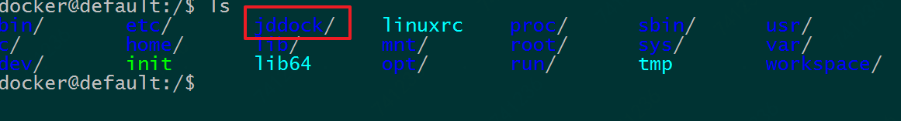

# 使用 Docker 统一部署本地开发环境

> Version: v1.0.0
>
> Author:  Syncher
>
> OS:  Windows 7
>
> Update: 2018-03-21 14:23:05

---


该项目使用 Docker 部署，因此需要对 Docker 有基本的了解，关于 Docker 的介绍、安装和基本使用可以查阅[《using-docker》](using-docker.pdf) 手册或自行 Google 之。

## 一、启动项目

1. 下载项目

    ```shell
    $ git clone https://github.com/brelian/webdock.git
    ```

2. 设置共享目录（Linux 无需设置共享目录）

    假设项目位于 `E:\webdock` 下，为了使 Docker 容器能访问到 Windows 的 `E:\webdock`文件夹，首先我们需要将 `E:\webdock` 文件夹共享给虚拟机 boot2docker。

    打开 Virtualbox --> 设置 --> 共享文件夹 --> 点击右侧的添加图标，添加共享文件夹，如图，勾选`自动挂载`和`固定分配`选项，点击 'OK' 即可完成文件夹共享。

    

    ​

    重启虚拟机 boot2docker，ssh 远程连接工具登录到 boot2docker 机器上，`ls /` 可查看到共享文件夹。

    

3. 在 Docker 宿主机上安装 Docker-compose

    因为 docker 宿主机 boot2docker 不会持久存储数据，因此每次开机都需要将 docker-compose 移动到其环境变量中：

    ```shell
    $ sudo cp /webdock/bin/docker-compose /usr/local/bin
    ```
    如果是 Linux 请通过以下方式下载符合自己机型的 `docker-compose`

    ```shell
    $ sudo curl -L https://github.com/docker/compose/releases/download/1.22.0/docker-compose-$(uname -s)-$(uname -m) -o /usr/local/bin/docker-compose
    $ sudo chmod +x /usr/local/bin/docker-compose
    ```

    ​

4. 启动项目

    第一次启动项目时会构建 Docker 镜像，需要耐心等待一会儿，另外要确保网络通畅且能访问 GitHub。

    ```shell
    $ cd /webdock
    $ docker-compose up -d mysql nginx
    ```

5. 配置主机 hosts 文件，添加

    ```
    [your-docker-machine-ip]  ci.jd.com
    ```

    访问 ci.jd.com


## 二、项目说明

项目组织架构

```shell
├─bin  # 存放 docker-compose 工具
├─images
├─projects # 站点目录，可以在 nginx 中配置多个站点
│  ├─codeigniter
│  └─laravel
│      └─public
└─webenv  # 开发环境容器目录
    ├─apache2
    │  └─sites
    ├─data # 容器持久存储路径，主要存放各数据库容器的数据
    │  └─mysql
    │      ├─default
    │      ├─mysql
    │      ├─performance_schema
    │      └─sys
    ├─laravel-echo-server
    ├─logs
    │  ├─apache2
    │  └─nginx
    ├─mariadb
    │  └─docker-entrypoint-initdb.d
    ├─memcached
    ├─mongo
    ├─mongo-webui
    ├─mysql
    │  ├─data
    │  └─docker-entrypoint-initdb.d
    ├─nginx
    │  └─sites # nginx 虚拟主机配置配件
    ├─php-fpm
    ├─phpmyadmin
    ├─portainer
    ├─redis
    ├─selenium
    └─workspace # 工作空间容器，集成了 Git/node/npm/python 等常用开发工具
        ├─crontab
        └─mc

```

项目位于 projects 路径下，多站点在 `webenv/nginx/sites` 下配置，配置完成后需要重启 `docker-compose down && docker-compose up -d nginx mysql` 。

### 2.1 Nginx 配置

配置文件位于 `webenv/nginx/sites` ，样例中分别给出了`CodeIgniter` 和 `Laravel` 框架的样例。

### 2.2 MySQL 配置

初始用户名密码在 `.env` 中配置

```shell
### MYSQL #################################################
MYSQL_VERSION=latest
MYSQL_DATABASE=default
MYSQL_USER=default
MYSQL_PASSWORD=secret
MYSQL_PORT=3306
MYSQL_ROOT_PASSWORD=root
MYSQL_ENTRYPOINT_INITDB=./mysql/docker-entrypoint-initdb.d
MYSQL_DATA_DIR=./mysql/data/
```

MySQL 数据库相关配置位于`webenv/mysql/my.cnf`，需要注意的是将数据映射到 Windows 7 的硬盘时，存储空间是 boot2docker 机和 Windows 7 共享的，不支持异步 I/O，所以

```
innodb_use_native_aio = 0
```


### 2.3 PHP	相关配置

PHP 相关配置位于 `webenv/php-fpm` 下找到对应版本做修改后重启容器。