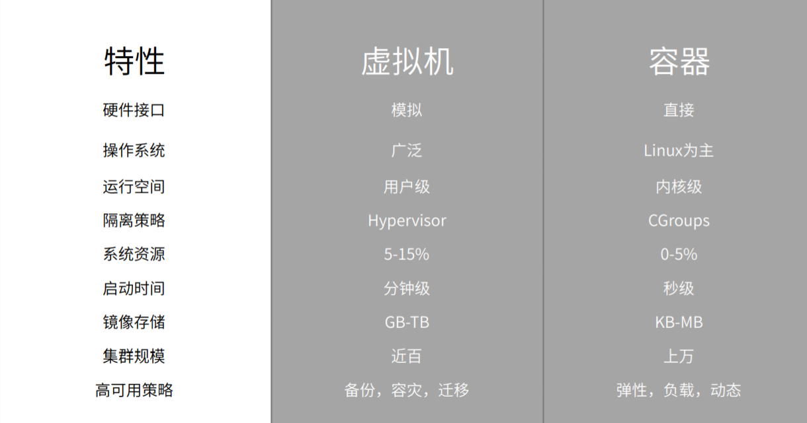
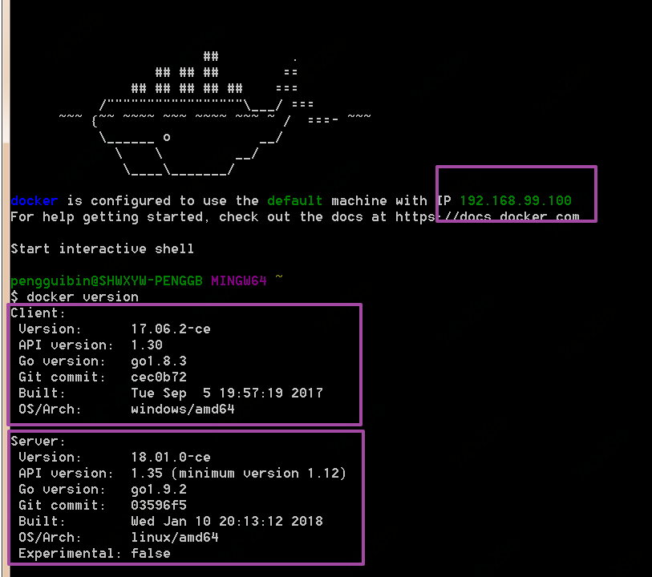
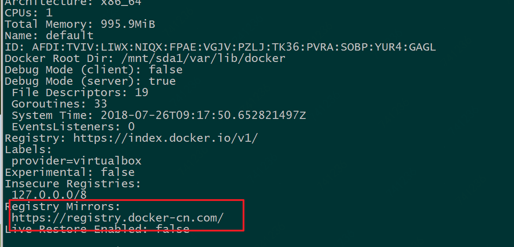

# Docker 基本使用教程

> Version: v1.0.0
>
> Author: Syncher
>
> Environment:  Windows 7
>
> Update: 2018-07-17 18:24:24

---


[TOC]

<div style="page-break-after: always;"></div>

## 一、认识 Docker

### Linux 容器（LXC）和 Docker
LXC 是Linux 发展的一种新的虚拟化技术，他的虚拟不是基于硬件层面的，而是对进程的隔离，再正常的进程外面套了一个保护层，封装称一个容器。

Docker 是基于 LXC  的封装，进一步封装了文件系统和网络互联和进程隔离等。Docker 使用 Google 公司推出的 [Go 语言](https://golang.org/) 进行开发实现，基于 Linux 内核的 [cgroup](https://zh.wikipedia.org/wiki/Cgroups)，[namespace](https://en.wikipedia.org/wiki/Linux_namespaces)，以及[AUFS](https://en.wikipedia.org/wiki/Aufs) 类的 [Union FS](https://en.wikipedia.org/wiki/Union_mount) 等技术，对进程进行封装隔离，属于 [操作系统层面的虚拟化技术](https://en.wikipedia.org/wiki/Operating-system-level_virtualization)。由于隔离的进程独立于宿主和其它的隔离的进程，因此也称其为容器。最初实现是基于 [LXC](https://linuxcontainers.org/lxc/introduction/)，从 0.7 版本以后开始去除 LXC，转而使用自行开发的 [libcontainer](https://github.com/docker/libcontainer)，从 1.11 开始，则进一步演进为使用 [runC](https://github.com/opencontainers/runc) 和 [containerd](https://github.com/containerd/**containerd**)。

传统虚拟化技术是基于硬件的虚拟化，与传统虚拟化技术不同，


Docker 是基于操作系统层面的虚拟化技术，


相比与传统的虚拟化技术，Docker 具有启动快、占用内存小、轻量、可动态扩容等特点，




### Docker 主要用途

1. **提供一次性环境，如本地开发环境、单元测试环境、构建环境等**
2. 弹性云服务，动态扩容
3. 组件微服务架构


### Docker 基本概念 —— 镜像、容器和仓库

- 镜像 image
  Docker 镜像是一个特殊的文件系统，除了提供容器运行时所需的程序、库、资源、配置等文件外，还包含了一些为运行时准备的一些配置参数（如匿名卷、环境变量、用户等）。镜像不包含任何动态数据，其内容在构建之后也不会被改变。

- 容器 Container
  容器是镜像的实例，是Docker服务直接操作的对象，容器可以被创建、启动、停止、删除和暂停等。
  容器的实质是进程，运行在属于自己的独立的命名空间。
  容器以镜像为基础层，并在此基础上创建了一个存储层，容器运行时，大部分读写操作都发生在存储层，存储层的生命周期和容器一致，容器销毁时存储层也随之消毁。

  按照 Docker 的最佳实践，容器存储层不应写入任何有效数据，所有文件的写入操作都应该使用数据卷(Volume)、或者绑定宿主目录，这样数据的读写会直接跳过容器的存储层，直接对宿主（或网络存储）发生读写，其性能和稳定性更加高。因此，数据卷是容器数据持久化的一种设计方案。

- 仓库 Registry
  和 Git 仓库类似，仓库是用与存储镜像的，Docker 中仓库名一般有两段路径构成，如  `daocloud.io/nginx` 前者是仓库地址，后者是仓库名称，一个仓库中包含多个标签 Tag,每个 Tag 对应一个镜像。

## 二、Docker 基本使用
### Windows 7 下安装 Docker
目前 Docker 分为两个发行版，社区版（CE）和企业版（EE），企业版提供一些收费服务，对于我们普通开发者来说，社区版就足以使用，所以我们选择安装社区版就行了。早期的 Docker 是基于 LXC 的，对于 Windows 7，官方提供了 [Docker Toolbox](https://download.docker.com/win/stable/DockerToolbox.exe) 集成工具用于支持 Docker。 Docker Toolbox 实际上集成了 VirtualBox、boot2docker 和一些 docker 常用工具，如 git、docker-compose、docker-machine 等。从官方下载 [Docker ToolBox ](https://download.docker.com/win/stable/DockerToolbox.exe)，安装即可（如需更加详细的安装教程可自行 Google 或百度之），需要注意的是安装路径不应有中文字符。

一般而言，安装完成之后，点击桌面上的 `Docker QuickStart Terminal` 快捷方式或进入安装目录双击 `start.sh`启动 Docker 服务。启动 Docker 服务后，使用如下命令查看 Docker 相关信息，

```shell
$ docker version

$ docker info
```



如图，Docker 分为客户端和服务端，与 Linux 不同的是 Docker 并不是直接运行在 Windows 系统之上的，而是运行在一个轻量级的 Linux 虚拟机上，这个虚拟机就是之前提到的 boot2docker。图中显示的 IP 地址`192.169.99.100`就是这个虚拟机的 IP，使用 xshell 或类似工具可以 ssh 连接到这台虚拟机上，默认用户名和密码分别是 `docker`和`tcuser`。


小试牛刀，

```shell
$ docker run hello-world
```

`docker run hello-world` 表示启动基于 `hello-world` 镜像容器，如果本地不存在 `hello-world`镜像那么将从远程镜像仓库 [docker hub](https://hub.docker.com/) 中下载，为了提高下载速度，我们可以手动修改镜像地址为国内镜像。

1. 修改 `profile` 文件

    ```shell
    $ sudo vi /var/lib/boot2docker/profile
    ```

    将`--registry-mirror=https://registry.docker-cn.com `  添加到  `EXTRA_ARGS`中


2. 重启 docker 服务

    ```shell
    $ sudo /etc/init.d/docker restart
    ```


3. 验证

    ```shell
    $ docker info
    ```

    


### 镜像管理

1. 从远程仓库拉取镜像

    >docker pull [选项]  \[地址]/仓库名:[标签]

    其中标签是镜像的标识，有点类似与版本号

    ```shell
    $ docker pull ubuntu:16.04
    ```


2. 查看镜像

    ```shell
    $ docker images
    $ docker image ls
    ```

    【注意】从查看结果中有些镜像没有仓库名也没有标签，这写镜像被成为虚悬镜像（dangling image），这些镜像没有名称一般是因为新镜像构建时与旧镜像同名导致旧镜像名称被占用。

    为了加速镜像构建，Docker 会利用中间层镜像，`docker image ls`只会列出顶层镜像，使用如下命令可以查看到中间层镜像，

    ```shell
    $ docker image ls -a
    ```


3. 删除本地镜像

    ```shell
    $ docker image rm [tag|id]
    ```

    前面提到过的虚悬镜像一般来讲，已经失去了存在的价值，可以用如下命令批量删除虚悬镜像，

    ```shell
    $ docker image prune
    ```

    ​
### 容器管理

1. 启动一个容器

    > docker run [container]

    ```shell
    $ docker run hello-world
    $ docker run -d nginx
    $ docker run -it --rm ubuntu:16.04 bash
    ```

    - -it：这是两个参数很重要，-t 是启动容器是分配一个伪终端，i 是让容器的标准输入保持打开。我们这里打算进入 bash 执行一些命令并查看返回结果，因此我们需要交互式终端。
    - --rm：这个参数是说容器退出后随之将其删除。默认情况下，为了排障需求，退出的容器并不会立即删除，除非手动 docker rm。我们这里只是随便执行个命令，看看结果，不需要排障和保留结果，因此使用 --rm 可以避免浪费空间。
    - ubuntu:16.04：这是指用 ubuntu:16.04 镜像为基础来启动容器。
    - bash：放在镜像名后的是命令，这里我们希望有个交互式 Shell，因此用的是 bash。
    - -d 是让容器作为宿主机的后台进程运行。

2. 查看容器

    > docker container ls 或 docker ps

3. 停止容器

    > docker [container] stop container_id || docker [container] kill container_id

    ```shell
    $ docker container stop 308bb024a63b
    $ docker stop 308bb024a63b
    $ docker container kill 308bb024a63b
    $ docker kill 308bb024a63b
    ```

4. 进入容器

    >  docker exec [OPTIONS] CONTAINER COMMAND [ARG...]\[flags]

    ```shell
    $ docker exec -it 124f52960169 bash
    ```

5. 删除容器

    > docker [container] rm container_id

    彻底从 `docker ps -a` 列表中删除，`docker start` 不能启动。

    > docker container prune

    清楚所有停止的容器

6. 保存容器的改变

    > docker commit [选项] <容器ID或容器名> [<仓库名>[:<标签>]]

    ```shell
    $ docker run --name mynginx -d -p 80:80 nginx:alpine
    ```

    进入容器

    ```shell
    $ docker exec -it mynginx bash
    OCI runtime exec failed: exec failed: container_linux.go:296: starting container process caused "exec: \"bash\": executable file not found in $PATH": unknown
    $ docker exec -it mynginx ls /bin/bash
    ls: /bin/bash: No such file or directory
    说明没有 bash，因此可以使用 sh
    $ docker exec -it mynginx sh
    $ echo "<center><h1>Hello docker</h1></center>" > /usr/share/nginx/html/index.html
    停止容器、容器的改变不会影响基础镜像，所以再次启动基础镜像时，内容不变
    $ docker stop mynginx
    $ docker rm mynginx
    $ docker run --name mynginx -d -p 80:80 nginx:alpine
    ```

    使用 `docker commit` 保存容器存储层的改变

    ```shell
    docker commit  --author "Syncher"  --message "updated index.html"   mynginx  nginx:alpine
    ```
## 三、Dockerfile 定制镜像

### 容器分层

Docker 镜像位于 bootfs 之上，镜像分层，每一层镜像的下面一层成为其父镜像，镜像启动之后称为容器， 容器在镜像之上堆叠新的一层，所有的镜像层都是 readonly，所以容器层的改变不会影响其父镜像。

如图，一个 Apache 镜像有 Debian 基础镜像堆叠 emacs 等工具镜像后打包而成，镜像启动后成为容器。


### 定制容器

使用 `docker commit` 可以保存容器的改变，但不建议以此方式定制容器，

```shell
$ docker image ls
$ docker image rm xxx
Error response from daemon: conflict: unable to delete 920e5c5c8bed (cannot be forced) - image has dependent child images
```

这种方式定制的容器是基于上一个父容器存储层的改变，因此存在相互依赖关系，使得镜像管理更加繁琐。

可以使用 Dockerfile 定制容器，如下定制自己的 `nginx` 容器，

```shell
$ mkdir mynginx
$ cd mynginx
$ touch Dockerfile
```

编辑 `Dockerfile`文件，添加以下内容

```shell
FROM nginx
RUN echo '<h1>Hello, Docker!</h1>' > /usr/share/nginx/html/index.html
```

构建容器

```shell
$ docker build -t ngxin:mynginx .
```


更多 `Dockerfile`  相关命令如下，

- FROM
- RUN
- COPY 本地文件拷贝到新一层的镜像内，新镜像存储路径可以用相对路径也可以用绝对路径，相对路径用 WORKDIR 命令指定
- ADD
- CMD
- ENTRYPOINT
- ENV  设置环境变量
- VOLUME 定义匿名卷
- EXPOSE 暴露端口
- WORKDIR
- USER


## 四、使用 Docker-compose

[Docker-compose](https://github.com/docker/compose ) 是官方开源的项目，用于编排、部署 Docker 项目(Define and run multi-container applications with Docker)。


### 4.1 定义 `docker-compose.yml`

```yaml
version: '2'

services:
  web:
     build: .
     ports:
      - "5000:5000"
     volumes:
      - .:/code
  redis:
     image: redis
```


### 4.2 docker-compose 命令

- `build`

  格式为 `docker-compose build [options] [SERVICE...]`。

  构建（重新构建）项目中的服务容器。

  服务容器一旦构建后，将会带上一个标记名，例如对于 web 项目中的一个 db 容器，可能是 web_db。

  可以随时在项目目录下运行 `docker-compose build` 来重新构建服务。

  选项包括：

  - `--force-rm` 删除构建过程中的临时容器。
  - `--no-cache` 构建镜像过程中不使用 cache（这将加长构建过程）。
  - `--pull` 始终尝试通过 pull 来获取更新版本的镜像。

  ​

- `config`

  验证 Compose 文件格式是否正确，若正确则显示配置，若格式错误显示错误原因。


- `down`

  此命令将会停止 `up` 命令所启动的容器，并移除网络

  ​

- `exec`

  进入指定的容器。

  ​

- `help`

  获得一个命令的帮助。

  ​

- `images`

  列出 Compose 文件中包含的镜像。

  ​

- `kill`

  格式为 `docker-compose kill [options] [SERVICE...]`。

  通过发送 `SIGKILL` 信号来强制停止服务容器。

  支持通过 `-s` 参数来指定发送的信号，例如通过如下指令发送 `SIGINT` 信号。

  ```
  $ docker-compose kill -s SIGINT
  ```
  ​

- `logs`

  格式为 `docker-compose logs [options] [SERVICE...]`。

  查看服务容器的输出。默认情况下，docker-compose 将对不同的服务输出使用不同的颜色来区分。可以通过 `--no-color` 来关闭颜色。

  该命令在调试问题的时候十分有用。

  ​

- `pause`

  格式为 `docker-compose pause [SERVICE...]`。

  暂停一个服务容器。

  ​

- `port`

  格式为 `docker-compose port [options] SERVICE PRIVATE_PORT`。

  打印某个容器端口所映射的公共端口。

  选项：

  - `--protocol=proto` 指定端口协议，tcp（默认值）或者 udp。
  - `--index=index` 如果同一服务存在多个容器，指定命令对象容器的序号（默认为 1）。

  ​

- `ps`

  格式为 `docker-compose ps [options] [SERVICE...]`。

  列出项目中目前的所有容器。

  选项：

  - `-q` 只打印容器的 ID 信息。

  ​

- `pull`

  格式为 `docker-compose pull [options] [SERVICE...]`。

  拉取服务依赖的镜像。

  选项：

  - `--ignore-pull-failures` 忽略拉取镜像过程中的错误。

  ​

- `push`

  推送服务依赖的镜像到 Docker 镜像仓库。

  ​

- `restart`

  格式为 `docker-compose restart [options] [SERVICE...]`。

  重启项目中的服务。

  选项：

  - `-t, --timeout TIMEOUT` 指定重启前停止容器的超时（默认为 10 秒）。

  ​

- `rm`

  格式为 `docker-compose rm [options] [SERVICE...]`。

  删除所有（停止状态的）服务容器。推荐先执行 `docker-compose stop` 命令来停止容器。

  选项：

  - `-f, --force` 强制直接删除，包括非停止状态的容器。一般尽量不要使用该选项。
  - `-v` 删除容器所挂载的数据卷。

  ​

- `run`

  格式为 `docker-compose run [options] [-p PORT...] [-e KEY=VAL...] SERVICE [COMMAND] [ARGS...]`。

  在指定服务上执行一个命令。

  例如：

  ```
  $ docker-compose run ubuntu ping docker.com
  ```

  将会启动一个 ubuntu 服务容器，并执行 `ping docker.com` 命令。

  默认情况下，如果存在关联，则所有关联的服务将会自动被启动，除非这些服务已经在运行中。

  该命令类似启动容器后运行指定的命令，相关卷、链接等等都将会按照配置自动创建。

  两个不同点：

  - 给定命令将会覆盖原有的自动运行命令；
  - 不会自动创建端口，以避免冲突。

  如果不希望自动启动关联的容器，可以使用 `--no-deps` 选项，例如

  ```
  $ docker-compose run --no-deps web python manage.py shell
  ```

  将不会启动 web 容器所关联的其它容器。

  选项：

  - `-d` 后台运行容器。
  - `--name NAME` 为容器指定一个名字。
  - `--entrypoint CMD` 覆盖默认的容器启动指令。
  - `-e KEY=VAL` 设置环境变量值，可多次使用选项来设置多个环境变量。
  - `-u, --user=""` 指定运行容器的用户名或者 uid。
  - `--no-deps` 不自动启动关联的服务容器。
  - `--rm` 运行命令后自动删除容器，`d` 模式下将忽略。
  - `-p, --publish=[]` 映射容器端口到本地主机。
  - `--service-ports` 配置服务端口并映射到本地主机。
  - `-T` 不分配伪 tty，意味着依赖 tty 的指令将无法运行。

  ​

- `scale`

  格式为 `docker-compose scale [options] [SERVICE=NUM...]`。

  设置指定服务运行的容器个数。

  通过 `service=num` 的参数来设置数量。例如：

  ```
  $ docker-compose scale web=3 db=2
  ```

  将启动 3 个容器运行 web 服务，2 个容器运行 db 服务。

  一般的，当指定数目多于该服务当前实际运行容器，将新创建并启动容器；反之，将停止容器。

  选项：

  - `-t, --timeout TIMEOUT` 停止容器时候的超时（默认为 10 秒）。

  ​

- `start`

  格式为 `docker-compose start [SERVICE...]`。

  启动已经存在的服务容器。


- `stop`

  格式为 `docker-compose stop [options] [SERVICE...]`。

  停止已经处于运行状态的容器，但不删除它。通过 `docker-compose start` 可以再次启动这些容器。

  选项：

  - `-t, --timeout TIMEOUT` 停止容器时候的超时（默认为 10 秒）。

  - `top`

  查看各个服务容器内运行的进程。

  ​

- `unpause`

  格式为 `docker-compose unpause [SERVICE...]`。

  恢复处于暂停状态中的服务。

  ​

- `up`

  格式为 `docker-compose up [options] [SERVICE...]`。

  该命令十分强大，它将尝试自动完成包括构建镜像，（重新）创建服务，启动服务，并关联服务相关容器的一系列操作。

  链接的服务都将会被自动启动，除非已经处于运行状态。

  可以说，大部分时候都可以直接通过该命令来启动一个项目。

  默认情况，`docker-compose up` 启动的容器都在前台，控制台将会同时打印所有容器的输出信息，可以很方便进行调试。

  当通过 `Ctrl-C` 停止命令时，所有容器将会停止。

  如果使用 `docker-compose up -d`，将会在后台启动并运行所有的容器。一般推荐生产环境下使用该选项。

  默认情况，如果服务容器已经存在，`docker-compose up` 将会尝试停止容器，然后重新创建（保持使用 `volumes-from` 挂载的卷），以保证新启动的服务匹配 `docker-compose.yml` 文件的最新内容。如果用户不希望容器被停止并重新创建，可以使用 `docker-compose up --no-recreate`。这样将只会启动处于停止状态的容器，而忽略已经运行的服务。如果用户只想重新部署某个服务，可以使用 `docker-compose up --no-deps -d <SERVICE_NAME>` 来重新创建服务并后台停止旧服务，启动新服务，并不会影响到其所依赖的服务。

  选项：

  - `-d` 在后台运行服务容器。
  - `--no-color` 不使用颜色来区分不同的服务的控制台输出。
  - `--no-deps` 不启动服务所链接的容器。
  - `--force-recreate` 强制重新创建容器，不能与 `--no-recreate` 同时使用。
  - `--no-recreate` 如果容器已经存在了，则不重新创建，不能与 `--force-recreate` 同时使用。
  - `--no-build` 不自动构建缺失的服务镜像。
  - `-t, --timeout TIMEOUT` 停止容器时候的超时（默认为 10 秒）。

  ​

- `version`

  格式为 `docker-compose version`。

  打印版本信息。


更多关于 docker-compose 的使用请参考[官方文档](https://docs.docker.com/compose/)。